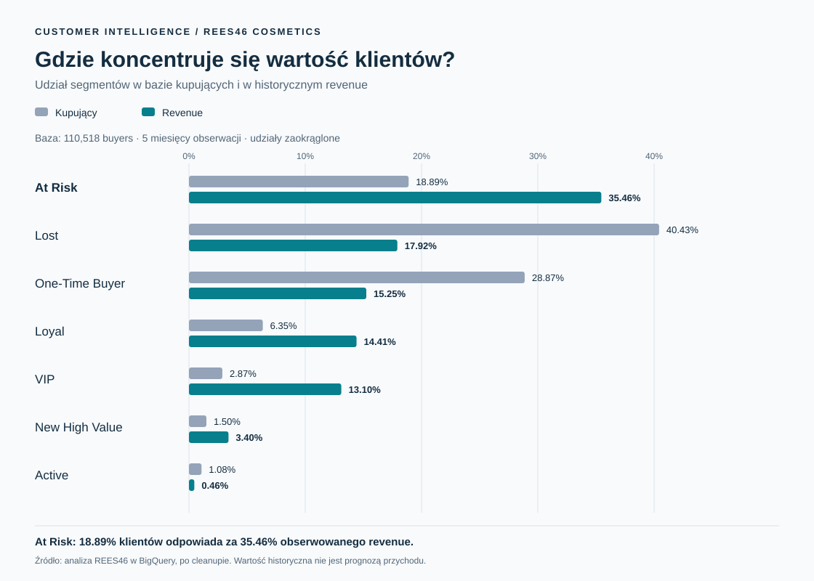

# Customer Intelligence & Lifecycle Marketing

**Jak zamienić dane o zachowaniu klientów sklepu kosmetycznego w priorytety CRM i plan działań zwiększających powtarzalność zakupów?**

Portfolio case study łączące SQL, Customer 360, kontrolę jakości danych, segmentację RFM i projektowanie komunikacji lifecycle. Punktem wyjścia jest problem biznesowy: pozyskanie kupującego nie oznacza jeszcze zbudowania relacji, która prowadzi do kolejnych zakupów.

> **Status projektu:** analiza została wykonana w **Google BigQuery Sandbox** na pełnym datasetcie REES46 Cosmetics obejmującym pięć miesięcy. Customer 360, kontrola jakości danych i finalna segmentacja RFM są rezultatami tej analizy. Działania lifecycle i testy A/B to **recommended strategy / experiment design** wynikające z ustaleń — nie wykonane kampanie.

## Problem biznesowy

Z 1,639,358 użytkowników zakup wykonało 110,518, czyli około 6.7%. Wśród kupujących **78.9% miało tylko jedną sesję zakupową** w obserwowanym okresie. To przesłanka do rozwijania drugiego zakupu i reaktywacji, a nie dowód trwałego odejścia klientów.

Najważniejszy priorytet CRM wynika z połączenia skali i wartości: **At Risk stanowiło 18.89% kupujących i odpowiadało za 35.46% obserwowanego revenue**. Ten segment warto objąć projektem win-back. Wysoka historyczna wartość nie oznacza jednak, że całe to revenue można odzyskać.

## Dane → analiza → decyzja

| Etap | Co obejmuje | Znaczenie biznesowe |
|---|---|---|
| Dane | REES46 Cosmetics, 5 miesięcy, 20,692,840 eventów | Obraz zachowań w ograniczonym oknie obserwacji |
| Customer 360 | Jeden rekord na `user_id`, zachowania, zakupy, wartość, daty zakupów | Wspólna podstawa do analizy i doboru odbiorców |
| Data quality | Ocena wartości zakupów i jawna korekta metryk | Ochrona przed błędną oceną wartości klienta |
| RFM | Recency, liczba sesji zakupowych, Monetary | Zestawienie aktualności relacji, powtarzalności i wartości |
| Segmentacja | Siedem segmentów biznesowych | Priorytety obsługi i różne cele komunikacji |
| Lifecycle | Cztery projekty journey i eksperymenty z kontrolą | Weryfikacja, czy komunikacja powoduje dodatkowe zakupy |

## Najważniejsze ustalenia

| Wskaźnik | Wynik | Interpretacja |
|---|---:|---|
| Kupujący | 110,518 | Użytkownicy z co najmniej jedną zarejestrowaną sesją zakupową (`purchase_sessions > 0`); baza RFM i udziałów segmentów |
| Udział kupujących w użytkownikach | ok. 6.7% | Udział użytkowników z zakupem w całym oknie; nie współczynnik konwersji sesji |
| Kupujący z jedną sesją zakupową | 78.9% | Sygnał potrzeby pracy nad drugim zakupem |
| Mediana odstępu między zakupami | 18 dni | Punkt odniesienia dla czasu komunikacji |
| p25 / p75 / p90 odstępu | 6 / 37 / 63 dni | Podstawa progów Recency; nie dowód optymalnego czasu wysyłki |

### Finalna segmentacja po cleanupie

| Segment | Klienci | Udział kupujących | Udział revenue | Średnie revenue na klienta | Kierunek działania |
|---|---:|---:|---:|---:|---|
| At Risk | 20,879 | 18.89% | 35.46% | 107.89 | Reaktywacja klientów o istotnej wartości historycznej |
| Lost | 44,685 | 40.43% | 17.92% | 25.47 | Osobny test odzyskania relacji, po sprawdzeniu ekonomiki |
| One-Time Buyer | 31,911 | 28.87% | 15.25% | 30.36 | Ułatwienie drugiego zakupu |
| Loyal | 7,017 | 6.35% | 14.41% | 130.46 | Utrzymanie relacji i rozwój wartości |
| VIP | 3,176 | 2.87% | 13.10% | 261.92 | Rozpoznanie wartości i korzyści premium |
| New High Value | 1,661 | 1.50% | 3.40% | 130.06 | Premium onboarding i szybki drugi zakup |
| Active | 1,189 | 1.08% | 0.46% | 24.38 | Standardowa komunikacja dopasowana do zachowania |

Revenue oznacza sumę dodatnich wartości zdarzeń `purchase` w przyjętej metodologii, a nie potwierdzony przychód księgowy. Waluta nie została podana. Udziały są zaokrąglone.



**Ważne rozróżnienie:** 78.9% kupujących z jedną sesją zakupową to metryka Frequency. Segment One-Time Buyer obejmuje 28.87% bazy i jest wynikiem klasyfikacji łączącej kryteria. Te grupy nie są tożsame; klient z jednym zakupem może trafić np. do segmentu określonego przez Recency.

## Jakość danych wpływa na decyzje marketingowe

Wykryto **126 ujemnych zdarzeń purchase**, dotyczących **108 użytkowników**, o łącznej wartości **-3825.42**. Nie były udokumentowane jako refundy. Zachowano surowe dane, ale wykluczono `price <= 0` z revenue i Monetary.

Segmentacja po korekcie pozostała stabilna; tabela powyżej przedstawia finalne wyniki po cleanupie. Ten sam filtr dodatnich purchase zastosowano do `avg_purchased_item_price`. Ujemne eventy pozostają w raw data, licznikach zakupów i sesji oraz datach zakupów. [Metodologia i ograniczenia](analysis/methodology.md) opisują definicje metryk i reguły segmentacji.

## Od segmentów do rekomendowanych działań

| Priorytet | Journey | Hipoteza do sprawdzenia | Główna miara |
|---|---|---|---|
| 1 | [At Risk](lifecycle/at-risk.md) | Trafne przypomnienie o wartości oferty zwiększy reaktywację | Odsetek klientów z zakupem w 28 dni |
| 2 | [One-Time Buyer](lifecycle/one-time-buyer.md) | Pomoc po pierwszym zakupie i dopasowana rekomendacja zwiększą drugi zakup | Odsetek klientów z drugą sesją zakupową w 37 dni |
| 3 | [New High Value](lifecycle/new-high-value.md) | Onboarding premium ułatwi szybki drugi zakup | Odsetek klientów z drugą sesją zakupową w 18 dni |
| 4 | [VIP / Loyal](lifecycle/vip-loyal.md) | Rozpoznanie wartości klienta i trafny cross-sell wesprą retencję | Odsetek klientów z zakupem w 37 dni |

Priorytety to rekomendacja, a horyzonty pomiaru to parametry projektowanych testów. Każdy journey zawiera cel, trigger, przebieg, kanał, strategię komunikacji, KPI, warunki wyjścia oraz warianty A/B z niezależną grupą kontrolną. [Wspólny plan eksperymentów](lifecycle/ab-test-plan.md) opisuje randomizację, pomiar efektu przyrostowego i ochronę przed nakładaniem się komunikacji.

## Co pokazuje ten projekt

- **SQL i customer intelligence:** konsolidację eventów, agregację do Customer 360, funkcje okna i kontrolę jakości metryk.
- **Segmentacja:** przełożenie RFM i rozkładu odstępów zakupowych na zrozumiałe grupy biznesowe.
- **CRM i marketing automation:** projektowanie triggerów, kolejności kontaktów, wykluczeń i warunków zakończenia journey.
- **Myślenie marketingowe:** dobór celu i przekazu do etapu relacji zamiast jednej kampanii dla całej bazy.
- **Pomiar:** odróżnienie historycznej wartości segmentu od efektu kampanii oraz projektowanie testów z kontrolą.

## Mapa repozytorium

```text
README.md
sql/
  01_events_all.sql          # Konsolidacja pięciu tabel miesięcznych
  02_customer_360.sql        # Profil użytkownika i odstępy zakupowe
  03_data_quality.sql        # Audyt i punkty kontrolne
  04_rfm_scoring.sql         # Jawne progi R / F / M
  05_customer_segments.sql   # Finalne reguły segmentacji
  06_campaign_audiences.sql  # Kandydaci do journey i podział testowy
analysis/
  key-findings.md
  methodology.md
lifecycle/
  at-risk.md
  one-time-buyer.md
  new-high-value.md
  vip-loyal.md
  ab-test-plan.md
visuals/
  segment-value.svg
  README.md
```

## Jak czytać i odtworzyć analizę

Najpierw przeczytaj [wnioski biznesowe](analysis/key-findings.md), następnie [metodologię](analysis/methodology.md) i wybrany journey. SQL jest dodatkiem pokazującym warsztat analityczny, a nie głównym produktem tego case study.

Analizę wykonano w **Google BigQuery Sandbox**, używając **Google Standard SQL / BigQuery SQL**. Pliki 01–05 dokumentują konsolidację danych, Customer 360, kontrolę jakości, scoring RFM i finalną segmentację. Plik 06 przekłada segmenty na rekomendowane grupy kampanii i projekt podziału eksperymentalnego.

Recency obliczono względem **`DATE '2020-02-29'`**. `purchase_sessions` jest **proxy for orders** — dataset nie ma klasycznego `order_id`. Segmenty wynikają z uporządkowanych reguł CASE: VIP → New High Value → At Risk → Loyal → Lost → One-Time Buyer → Active. Kolejność jest istotna: klient o wysokiej wartości lub powtarzalnych zakupach może pozostać At Risk także po 63 dniach bez zakupu.

Aby odtworzyć analizę we własnym BigQuery, zamień `YOUR_PROJECT_ID` na identyfikator projektu i przyporządkuj nazwy `raw.events_month_01`–`raw.events_month_05` do pięciu tabel miesięcznych. Zachowaj tę samą lokalizację datasetów `raw` i `analytics`, a pliki uruchom w kolejności 01–06. Zapytania zachowują surowe dane i tworzą odtwarzalne widoki BigQuery dla wygody reprodukcji. Właściwa analiza została wykonana na zapisanych tabelach BigQuery. Audyty porównują wyniki z finalnymi statystykami case study.

Grupy w `06_campaign_audiences.sql` są projektem aktywacji opartym na historycznej segmentacji. Przed rzeczywistą wysyłką wymagają aktualnego snapshotu, powiązania z CRM, zgód i kontroli kolizji journey. Historyczna data analizy pozostaje stała w kodzie case study.

Źródło wyników: wykonana w BigQuery analiza pełnego datasetu REES46 Cosmetics w Projekcie „Customer Intelligence & Lifecycle Marketing”. Rekomendacje marketingowe wynikają z tej analizy; nie przypisano im wyników kampanii, upliftów ani przeprowadzonych eksperymentów.
